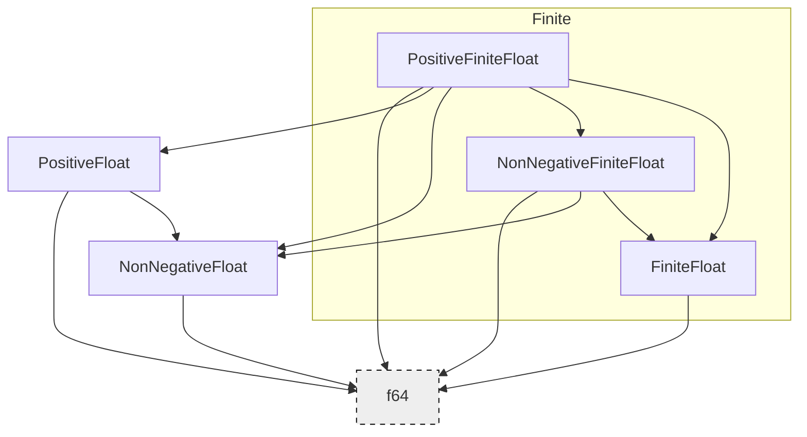

# ItoLib-Types floats

Below is a diagram representing the relationships between the different floats provided in this module.

An arrow pointing from `A` to `B` means that `A` can be cast to `B` using `Into` (infallible), but a cast from `B`
to `A` requires a `TryInto` (fallible).

One thing to note is that while all types defined in this module can be converted to `f64`, `Into<f64>` is intentionally
not provided. The reason for this is that we want to be very explicit when converting out of our typed float system, and
we have `.value()` for this reason.
